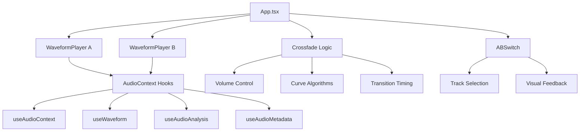

# PlaybackEngine Overview 🎵

The PlaybackEngine is the core audio system that powers MixFade's professional A/B comparative playback experience. It provides seamless dual-track playback with sophisticated crossfading capabilities, real-time audio analysis, and professional-grade audio processing.

## Table of Contents

- [Architecture Overview](#architecture-overview)
- [A/B Comparative Playback](#ab-comparative-playback)
- [Crossfade System](#crossfade-system)
- [Audio Context Management](#audio-context-management)
- [Real-time Analysis](#real-time-analysis)
- [Volume Control System](#volume-control-system)
- [Keyboard Control](#keyboard-control)
- [Technical Implementation](#technical-implementation)
- [Performance Optimization](#performance-optimization)
- [Error Handling](#error-handling)

## Architecture Overview

The PlaybackEngine consists of several interconnected components:



### Key Components

- **WaveformPlayer**: Dual instances for Track A and Track B
- **ABSwitch**: Track selection and crossfade initiation
- **Crossfade Engine**: Professional transition algorithms
- **Audio Context Manager**: Web Audio API integration
- **Analysis Pipeline**: Real-time audio analysis
- **Volume System**: Hierarchical volume control

## A/B Comparative Playback

### Dual Track System

The PlaybackEngine supports simultaneous loading and playback of two audio tracks:

```typescript
interface TrackState {
  trackA: File | null;
  trackB: File | null;
  activeTrack: 'A' | 'B' | 'both';
  isTrackAPlaying: boolean;
  isTrackBPlaying: boolean;
}
```

### Track Management

#### Individual Track Control
- **Independent Playback**: Each track can be played/paused individually
- **Synchronized Control**: Both tracks can be controlled simultaneously
- **Active Track Logic**: Smart switching based on loaded content

#### Track Selection Logic
```typescript
// Auto-switching based on available tracks
if (trackA && !trackB) {
  setActiveTrack('A');
} else if (!trackA && trackB) {
  setActiveTrack('B');
} else if (trackA && trackB) {
  // Both tracks available - user control
}
```

### Playback States

1. **Single Track Mode**: One track loaded, simple playback
2. **Dual Track Mode**: Both tracks loaded, A/B comparison available
3. **Crossfade Mode**: Transitioning between tracks
4. **Synchronized Mode**: Both tracks playing simultaneously

## Crossfade System

### Professional Crossfade Curves

The system supports three industry-standard crossfade curves:

#### 1. Equal Power (Default)
```typescript
const angle = progress * (Math.PI / 2);
return {
  fadeOut: Math.cos(angle), // Smooth curve from 1 to 0
  fadeIn: Math.sin(angle)   // Smooth curve from 0 to 1
};
```
- **Use Case**: Most music applications
- **Characteristic**: Maintains constant perceived loudness
- **Algorithm**: Sine/cosine curves for smooth transition

#### 2. Linear
```typescript
return {
  fadeOut: 1 - progress,
  fadeIn: progress
};
```
- **Use Case**: Technical analysis, predictable behavior
- **Characteristic**: Straight-line volume transition
- **Algorithm**: Simple linear interpolation

#### 3. Logarithmic
```typescript
const logProgress = Math.log(progress * 9 + 1) / Math.log(10);
return {
  fadeOut: 1 - logProgress,
  fadeIn: logProgress
};
```
- **Use Case**: Dramatic transitions, creative effects
- **Characteristic**: Non-linear, accelerating transition
- **Algorithm**: Logarithmic curve for emphasis

### Crossfade Implementation

#### Transition Process
```typescript
const performCrossfade = (fromTrack: 'A' | 'B', toTrack: 'A' | 'B') => {
  const transitionDuration = settings.audio.crossfadeTime * 1000;
  const steps = Math.max(30, Math.floor(settings.analysis.updateRate));
  const stepDuration = transitionDuration / steps;
  
  // Smooth interpolation over multiple steps
  for (let step = 1; step <= steps; step++) {
    setTimeout(() => {
      const progress = step / steps;
      const { fadeOut, fadeIn } = getCrossfadeCurve(progress);
      applyVolumes(fadeOut, fadeIn);
    }, step * stepDuration);
  }
};
```

#### Configurable Parameters
- **Duration**: 0.5s to 5.0s (user configurable)
- **Update Rate**: Tied to analysis update rate for smoothness
- **Curve Type**: Selectable via settings
- **Step Resolution**: Minimum 30 steps for smooth transitions

### Visual Feedback

The ABSwitch component provides real-time visual feedback:

- **Active Track Highlighting**: Glowing effects for current track
- **Transition Indicators**: Progress bars during crossfade
- **Volume Visualization**: Real-time volume level display
- **State Colors**: Green for Track A, Purple for Track B

## Audio Context Management

### Web Audio API Integration

The PlaybackEngine uses the Web Audio API for professional audio processing:

```typescript
interface AudioContextNodes {
  context: AudioContext;
  source: MediaElementAudioSourceNode;
  analyser: AnalyserNode;
  leftAnalyser: AnalyserNode;
  rightAnalyser: AnalyserNode;
  splitter: ChannelSplitterNode;
  gainNode: GainNode;
}
```

### Node Graph Architecture
```
Audio Element → Source Node → Gain Node → Splitter → Analysers → Output
                                    ↓
                              Volume Control
```

### Context Lifecycle
1. **Initialization**: Create audio context on first user interaction
2. **Setup**: Connect audio element to node graph
3. **Processing**: Real-time analysis and effects
4. **Cleanup**: Proper resource disposal

## Real-time Analysis

### Analysis Pipeline

The PlaybackEngine provides comprehensive real-time audio analysis:

#### Frequency Analysis
- **FFT Size**: 2048 samples for detailed frequency resolution
- **Update Rate**: Configurable (30-120 FPS)
- **Frequency Bands**: Logarithmic spacing for musical relevance
- **Smoothing**: Time-averaged for stable visualization

#### Level Monitoring
- **Peak Levels**: Instant peak detection
- **RMS Levels**: Power-averaged levels
- **LUFS Monitoring**: Broadcast-standard loudness
- **True Peak**: Oversampled peak detection

#### Stereo Analysis
- **Phase Correlation**: Stereo compatibility measurement
- **Stereo Width**: Spatial image analysis
- **Channel Balance**: Left/right level comparison
- **Mid/Side Analysis**: Professional stereo processing

### Analysis Data Flow

```typescript
interface AnalysisCallbacks {
  onAudioLevels?: (levels: AudioLevels) => void;
  onFrequencyData?: (data: Float32Array) => void;
  onStereoData?: (data: StereoAnalysis) => void;
}
```

### Performance Optimization
- **Conditional Updates**: Analysis only during playback
- **Rate Limiting**: User-configurable update rates
- **Efficient Algorithms**: Optimized DSP calculations
- **Memory Management**: Proper buffer reuse

## Volume Control System

### Hierarchical Volume Control

The PlaybackEngine implements a sophisticated volume control system:

```typescript
// Volume hierarchy (multiplicative)
finalVolume = baseVolume × crossfadeVolume × muteState
```

#### Volume Levels
1. **Base Volume**: User-controlled track volume (0-1)
2. **Crossfade Volume**: Transition-controlled volume (0-1)
3. **Mute State**: Binary on/off control
4. **Final Volume**: Applied to audio element and gain node

### Volume Application

#### Dual Control Points
```typescript
// Audio element volume (immediate)
audio.volume = finalVolume;

// Gain node volume (Web Audio API)
gainNode.gain.value = finalVolume;
```

#### Crossfade Integration
- **Track A Volume**: `volumeA × baseVolumeA × !isMutedA`
- **Track B Volume**: `volumeB × baseVolumeB × !isMutedB`
- **Transition Smoothing**: Interpolated over multiple frames

## Keyboard Control

### Shortcut System

Professional keyboard shortcuts for efficient workflow:

```typescript
const shortcuts = {
  'space': handlePlayPause,        // Play/pause active track
  'tab': handleCrossfade,          // Initiate crossfade
  'ctrl+b': toggleSidebar,         // Show/hide sidebar
  'ctrl+shift+e': openFiles,      // Files panel
  'ctrl+shift+a': openAnalysis,   // Analysis panel
  'ctrl+,': openSettings,         // Settings panel
  'f1': openHelp                  // Help panel
};
```

### Context-Aware Behavior
- **Single Track**: Space controls the loaded track
- **Dual Track**: Space controls the active track
- **Crossfade**: Tab initiates transition between tracks
- **Both Mode**: Space controls both tracks simultaneously

## Technical Implementation

### Component Architecture

#### WaveformPlayer Component
```typescript
interface WaveformPlayerProps {
  file: File;
  color: 'green' | 'purple';
  label: string;
  crossfadeVolume?: number;
  onPlayStateChange?: (isPlaying: boolean) => void;
  onAudioLevels?: (levels: AudioLevels) => void;
  onFrequencyData?: (data: Float32Array) => void;
  onStereoData?: (data: StereoAnalysis) => void;
}
```

#### Modular Hook System
- **useAudioContext**: Web Audio API management
- **useWaveform**: Waveform generation and display
- **useAudioAnalysis**: Real-time analysis processing
- **useAudioMetadata**: File metadata extraction

### State Management

#### Playback State
```typescript
interface PlaybackState {
  isPlaying: boolean;
  currentTime: number;
  duration: number;
  volume: number;
  isMuted: boolean;
  isLoading: boolean;
  error: string | null;
}
```

#### Crossfade State
```typescript
interface CrossfadeState {
  isTransitioning: boolean;
  volumeA: number;
  volumeB: number;
  activeTrack: 'A' | 'B' | 'both';
}
```

### Error Handling

#### Robust Error Management
- **File Loading Errors**: Graceful degradation with user feedback
- **Audio Context Errors**: Automatic recovery attempts
- **Crossfade Interruption**: Safe state cleanup
- **Memory Management**: Proper resource disposal

#### Error Recovery
```typescript
try {
  await initializeAudio();
} catch (error) {
  setError(error.message);
  audioContext.cleanup();
  // Fallback to basic audio element
}
```

## Performance Optimization

### Efficient Resource Management

#### Memory Optimization
- **Object URL Cleanup**: Automatic blob URL revocation
- **Audio Buffer Reuse**: Efficient waveform data management
- **Analysis Buffer Pooling**: Reused Float32Arrays

#### Computational Efficiency
- **Frame Rate Control**: Adaptive analysis update rates
- **Conditional Processing**: Analysis only during playback
- **Optimized Algorithms**: Fast Fourier transforms and level calculations

### Responsiveness

#### Non-blocking Operations
- **Async Audio Loading**: Non-blocking file processing
- **Web Workers**: Heavy computations off main thread
- **Smooth Animations**: 60 FPS crossfade transitions

## Error Handling

### Comprehensive Error Coverage

#### Audio Loading Errors
```typescript
const handleAudioError = (error: Error) => {
  console.error('Audio initialization failed:', error);
  setError(`Failed to load audio: ${error.message}`);
  audioContext.cleanup();
  setIsLoading(false);
};
```

#### Crossfade Error Recovery
- **Transition Interruption**: Clean state reset
- **Invalid Audio States**: Graceful degradation
- **Resource Cleanup**: Proper disposal on errors

### User Feedback
- **Loading States**: Visual progress indicators
- **Error Messages**: Clear, actionable error descriptions
- **Recovery Actions**: Automatic retry mechanisms

---

## Integration Points

### Main Application Integration
The PlaybackEngine integrates with:
- **File Management**: Drag & drop, file selection
- **Analysis Display**: Real-time visualization
- **Settings System**: User preferences
- **Keyboard Shortcuts**: Global hotkeys

### Future Enhancements
- **Multi-track Support**: Beyond A/B comparison
- **Advanced Effects**: EQ, filters, dynamics
- **Session Management**: Project save/load
- **Cloud Integration**: Remote file access

The PlaybackEngine provides a professional foundation for audio comparison and analysis, with room for future expansion while maintaining excellent performance and user experience. 