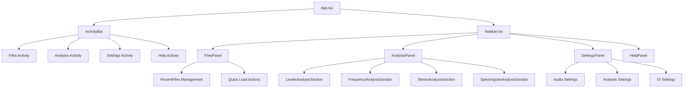
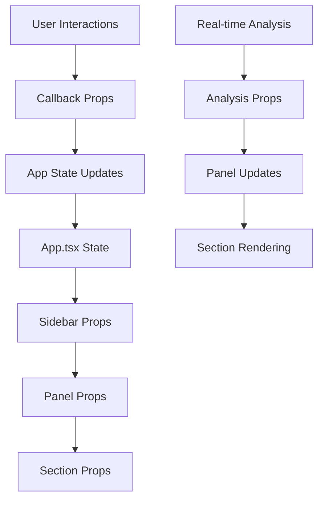

# Sidebar System Overview 🎛️

The Sidebar system provides a comprehensive interface for file management, real-time analysis, settings configuration, and help resources. Built with a modular panel architecture, it offers efficient workflow management with responsive design and keyboard navigation.

## Table of Contents

- [Architecture Overview](#architecture-overview)
- [Panel System](#panel-system)
- [Files Panel](#files-panel)
- [Analysis Panel](#analysis-panel)
- [Settings Panel](#settings-panel)
- [Help Panel](#help-panel)
- [Activity Bar Integration](#activity-bar-integration)
- [Data Flow Architecture](#data-flow-architecture)
- [Responsive Design](#responsive-design)
- [Performance Optimization](#performance-optimization)
- [Keyboard Navigation](#keyboard-navigation)

## Architecture Overview

The Sidebar system implements a modular panel architecture with activity-based navigation:



### Core Components

- **Sidebar.tsx**: Main container and routing logic
- **ActivityBar.tsx**: Navigation and activity selection
- **Panel Components**: Specialized content panels
- **Analysis Sections**: Real-time data visualization
- **Settings Management**: Configuration interface

## Panel System

### Modular Panel Architecture

The sidebar uses a switching panel system based on the active activity:

```typescript
interface SidebarProps {
  activeActivity: string;
  isCollapsed: boolean;
  onToggle: () => void;
  // Panel-specific props
  recentFiles?: RecentFile[];
  // Analysis data
  trackAFile?: File;
  trackBFile?: File;
  trackAAudioLevels?: AudioLevels;
  // ... additional analysis props
}
```

### Panel Routing Logic

```typescript
const renderContent = () => {
  switch (activeActivity) {
    case 'files':
      return <FilesPanel {...filesPanelProps} />;
    case 'analysis':
      return <AnalysisPanel {...analysisPanelProps} />;
    case 'settings':
      return <SettingsPanel />;
    case 'help':
      return <HelpPanel />;
    default:
      return <DefaultPanel />;
  }
};
```

### Common Panel Structure

Each panel follows a consistent structure:

```typescript
interface BasePanelProps {
  className?: string;
  // Panel-specific props extend this base
}

const PanelLayout = ({ children, title, icon }: PanelLayoutProps) => (
  <div className="p-4 space-y-6 max-h-full overflow-y-auto scrollbar-sidebar">
    <h3 className="text-xs font-semibold text-slate-400 uppercase tracking-wide">
      {title}
    </h3>
    {children}
  </div>
);
```

## Files Panel

### Component Architecture

The FilesPanel manages file operations and recent file access:

```typescript
interface FilesPanelProps {
  recentFiles?: RecentFile[];
  onLoadFileFromRecent?: (recentFile: RecentFile) => void;
  onLoadToA?: (file: File | null) => void;
  onLoadToB?: (file: File | null) => void;
}
```

### Recent Files Management

#### RecentFile Interface
```typescript
interface RecentFile {
  id: string;
  name: string;
  size: string;
  lastModified: string;
  lastUsedSide: 'A' | 'B';
  file?: File; // In-memory during session
  filePath?: string; // Future file system access
}
```

#### File Loading Logic
```typescript
const handleLoadToA = () => {
  const input = document.createElement('input');
  input.type = 'file';
  input.accept = 'audio/*';
  input.onchange = (e) => {
    const file = (e.target as HTMLInputElement).files?.[0];
    if (file && onLoadToA) {
      onLoadToA(file);
    }
  };
  input.click();
};
```

### Quick Load Actions

- **Load to A**: Direct file selection for Track A
- **Load to B**: Direct file selection for Track B
- **Track Color Coding**: Green for Track A, Purple for Track B
- **File Type Filtering**: Audio files only

### Recent Files Display

#### Visual Design
- **File Icons**: Music note icons for visual consistency
- **Track Indicators**: Color-coded badges (A/B)
- **File Metadata**: Size and modification date
- **Hover Effects**: Interactive feedback

#### Interaction Model
- **Click to Load**: Single click loads to last used side
- **Visual Feedback**: Hover states and loading indicators
- **Accessibility**: Keyboard navigation support

## Analysis Panel

### Real-time Analysis Display

The AnalysisPanel provides comprehensive real-time audio analysis visualization:

```typescript
interface AnalysisPanelProps {
  trackAFile?: File;
  trackBFile?: File;
  trackAAudioLevels?: AudioLevels;
  trackBAudioLevels?: AudioLevels;
  trackAStereoData?: StereoAnalysis;
  trackBStereoData?: StereoAnalysis;
  trackAFrequencyData?: Float32Array;
  trackBFrequencyData?: Float32Array;
  isTrackAPlaying: boolean;
  isTrackBPlaying: boolean;
  // Crossfade integration
  isTransitioning?: boolean;
  volumeA?: number;
  volumeB?: number;
}
```

### Analysis Sections Architecture

#### 1. Levels Analysis Section
```typescript
<LevelsAnalysisSection
  trackALevels={trackASmoothed}
  trackBLevels={trackBSmoothed}
  isTrackAPlaying={isTrackAPlaying}
  isTrackBPlaying={isTrackBPlaying}
  crossfadeInfo={{ isTransitioning, volumeA, volumeB }}
/>
```

#### 2. Frequency Analysis Section
```typescript
<FrequencyAnalysisSection
  trackAFrequency={trackAFreqSmoothed}
  trackBFrequency={trackBFreqSmoothed}
  isTrackAPlaying={isTrackAPlaying}
  isTrackBPlaying={isTrackBPlaying}
/>
```

#### 3. Stereo Analysis Section
```typescript
<StereoAnalysisSection
  trackAStereo={trackAStereoSmoothed}
  trackBStereo={trackBStereoSmoothed}
  isTrackAPlaying={isTrackAPlaying}
  isTrackBPlaying={isTrackBPlaying}
/>
```

#### 4. Spectrogram Analysis Section
```typescript
<SpectrogramAnalysisSection
  trackASpectrogram={trackASpectrogramSmoothed}
  trackBSpectrogram={trackBSpectrogramSmoothed}
  isTrackAPlaying={isTrackAPlaying}
  isTrackBPlaying={isTrackBPlaying}
/>
```

### Data Smoothing System

#### Multi-layer Smoothing
The AnalysisPanel implements sophisticated data smoothing:

```typescript
// RMS Averaging
const rmsAveragerA = useRef<RMSAverager | null>(null);
const rmsAveragerB = useRef<RMSAverager | null>(null);

// Frequency Averaging
const frequencyAveragerA = useRef<FrequencyAverager | null>(null);
const frequencyAveragerB = useRef<FrequencyAverager | null>(null);

// Stereo Averaging
const stereoAveragerA = useRef<StereoAverager | null>(null);
const stereoAveragerB = useRef<StereoAverager | null>(null);

// Spectrogram Averaging
const spectrogramAveragerA = useRef<SpectrogramAverager | null>(null);
const spectrogramAveragerB = useRef<SpectrogramAverager | null>(null);
```

#### Averaging Configuration
```typescript
// 300ms window, 100ms updates (optimized for sidebar display)
new RMSAverager(300, 100);
new FrequencyAverager(300, 100);
new StereoAverager(300, 100);
new SpectrogramAverager(300, 100);
```

### Crossfade-Aware Analysis

#### Pre-crossfade Snapshot System
```typescript
// Capture analysis state before crossfade begins
const capturePreCrossfadeState = () => {
  setPreCrossfadeTrackA(trackASmoothed);
  setPreCrossfadeTrackB(trackBSmoothed);
  setPreCrossfadeFreqA(trackAFreqSmoothed);
  setPreCrossfadeFreqB(trackBFreqSmoothed);
  // ... additional analysis types
};
```

#### Transition Detection
```typescript
useEffect(() => {
  if (isTransitioning && !prevIsTransitioning) {
    // Crossfade just started - capture current state
    capturePreCrossfadeState();
  }
  setPrevIsTransitioning(isTransitioning);
}, [isTransitioning, prevIsTransitioning]);
```

### Analysis Snapshot System

#### Snapshot Interface
```typescript
interface AnalysisSnapshot {
  id: string;
  timestamp: number;
  trackAFile?: string;
  trackBFile?: string;
  trackAAudioLevels?: AudioLevels;
  trackBAudioLevels?: AudioLevels;
  trackAFrequencyAnalysis?: FrequencyAnalysis;
  trackBFrequencyAnalysis?: FrequencyAnalysis;
  // ... complete analysis state
}
```

#### Snapshot Management
- **Automatic Capture**: During significant events
- **Manual Capture**: User-initiated snapshots
- **Persistent Storage**: localStorage integration
- **Comparison Tools**: Side-by-side snapshot comparison

## Settings Panel

### Settings Management Integration

The SettingsPanel integrates with the global SettingsContext:

```typescript
const SettingsPanel = () => {
  const { settings, updateSettings } = useSettings();
  
  return (
    <div className="p-4 space-y-6 max-h-full overflow-y-auto scrollbar-sidebar">
      <AudioSettings settings={settings.audio} onUpdate={updateSettings} />
      <AnalysisSettings settings={settings.analysis} onUpdate={updateSettings} />
      <UISettings settings={settings.ui} onUpdate={updateSettings} />
    </div>
  );
};
```

### Settings Categories

#### Audio Settings
- **Crossfade Duration**: 0.5s to 5.0s
- **Crossfade Curve**: Linear, Logarithmic, Equal Power
- **Sample Rate**: Auto-detect or manual
- **Buffer Size**: Optimization settings

#### Analysis Settings
- **Update Rate**: 30-120 FPS
- **FFT Size**: 512-8192 samples
- **Smoothing Factor**: Time averaging parameters
- **Display Preferences**: Color schemes, scales

#### UI Settings
- **Theme Preferences**: Dark/light mode
- **Keyboard Shortcuts**: Customizable hotkeys
- **Panel Preferences**: Default active panels
- **Accessibility**: Screen reader support

### Live Settings Updates

```typescript
const handleSettingChange = useCallback((path: string, value: any) => {
  updateSettings({
    ...settings,
    [path]: value
  });
  
  // Immediate effect application
  if (path.startsWith('audio.')) {
    applyAudioSettings();
  } else if (path.startsWith('analysis.')) {
    restartAnalysis();
  }
}, [settings, updateSettings]);
```

## Help Panel

### Documentation Integration

The HelpPanel provides contextual help and documentation access:

```typescript
const HelpPanel = () => (
  <div className="p-4 space-y-6">
    <KeyboardShortcuts />
    <QuickStart />
    <TroubleshootingGuide />
    <DocumentationLinks />
    <VersionInfo />
  </div>
);
```

### Help Content Categories

#### Keyboard Shortcuts
- **Playback Controls**: Space, Tab navigation
- **Panel Navigation**: Ctrl+Shift+E, A, etc.
- **Advanced Features**: Custom shortcut display

#### Quick Start Guide
- **File Loading**: Drag & drop, file selection
- **A/B Comparison**: Track switching, crossfading
- **Analysis Features**: Real-time monitoring

#### Troubleshooting
- **Common Issues**: Audio playback problems
- **Performance Tips**: Optimization suggestions
- **Error Recovery**: Step-by-step solutions

## Activity Bar Integration

### Activity Management

The ActivityBar provides navigation between sidebar panels:

```typescript
interface Activity {
  id: string;
  label: string;
  icon: React.ComponentType<any>;
  shortcut?: string;
  description?: string;
}

const activities: Activity[] = [
  { id: 'files', label: 'Files', icon: FolderOpen, shortcut: 'Ctrl+Shift+E' },
  { id: 'analysis', label: 'Analysis', icon: BarChart3, shortcut: 'Ctrl+Shift+A' },
  { id: 'settings', label: 'Settings', icon: Settings, shortcut: 'Ctrl+,' },
  { id: 'help', label: 'Help', icon: HelpCircle, shortcut: 'F1' }
];
```

### Visual State Management

#### Active State Indicators
- **Highlighting**: Active activity visual feedback
- **Icons**: Consistent iconography
- **Tooltips**: Keyboard shortcut display
- **Badge Notifications**: Update indicators

#### Responsive Behavior
- **Collapsed State**: Icon-only display
- **Expanded State**: Full labels
- **Auto-collapse**: Smart width management

## Data Flow Architecture

### Props-Based Communication

The Sidebar uses a props-based data flow architecture:



### State Management Pattern

#### Top-Down Data Flow
```typescript
// App.tsx manages all sidebar-related state
const [activeActivity, setActiveActivity] = useState('files');
const [sidebarCollapsed, setSidebarCollapsed] = useState(false);

// Data flows down through props
<Sidebar
  activeActivity={activeActivity}
  isCollapsed={sidebarCollapsed}
  trackAAudioLevels={trackAAudioLevels}
  onToggle={() => setSidebarCollapsed(!sidebarCollapsed)}
/>
```

#### Callback-Based Updates
```typescript
// Panel components communicate up through callbacks
const handleFileLoad = useCallback((file: File, side: 'A' | 'B') => {
  if (side === 'A') {
    setTrackA(file);
  } else {
    setTrackB(file);
  }
}, []);
```

### Performance Considerations

#### Memoization Strategy
```typescript
const memoizedAnalysisData = useMemo(() => ({
  trackAAudioLevels,
  trackBAudioLevels,
  trackAFrequencyData,
  trackBFrequencyData
}), [trackAAudioLevels, trackBAudioLevels, trackAFrequencyData, trackBFrequencyData]);
```

#### Conditional Rendering
```typescript
// Only render analysis when data is available
{trackAAudioLevels && trackBAudioLevels && (
  <AnalysisSection data={memoizedAnalysisData} />
)}
```

## Responsive Design

### Adaptive Layout System

The Sidebar implements responsive design principles:

#### Breakpoint Management
```typescript
const sidebarWidth = {
  collapsed: '0px',
  normal: '224px', // 56rem equivalent
  expanded: '280px' // For larger screens
};
```

#### Collapsible Architecture
```typescript
const SidebarLayout = ({ isCollapsed, children }: SidebarLayoutProps) => (
  <div 
    className={`transition-all duration-300 ${isCollapsed ? 'w-0' : 'w-56'}`}
    style={{
      background: `linear-gradient(rgba(15, 23, 42, 0.6), rgba(15, 23, 42, 0.6)), 
                   linear-gradient(to right, rgb(16, 185, 129), rgb(168, 85, 247))`,
      backgroundSize: '300% 100%',
      backgroundPosition: '50% 0%'
    }}
  >
    {!isCollapsed && children}
  </div>
);
```

### Content Overflow Management

#### Scrollable Areas
```typescript
// Custom scrollbar styling for consistent appearance
.scrollbar-sidebar {
  scrollbar-width: thin;
  scrollbar-color: rgba(148, 163, 184, 0.3) transparent;
}

.scrollbar-sidebar::-webkit-scrollbar {
  width: 6px;
}

.scrollbar-sidebar::-webkit-scrollbar-thumb {
  background-color: rgba(148, 163, 184, 0.3);
  border-radius: 3px;
}
```

#### Content Truncation
- **Filename Truncation**: Ellipsis for long names
- **Responsive Text**: Size adaptation
- **Priority Content**: Most important information first

## Performance Optimization

### Efficient Rendering

#### Virtualization Considerations
For large datasets (like recent files), virtual scrolling can be implemented:

```typescript
// Future enhancement for large file lists
const VirtualizedFileList = ({ files }: VirtualizedFileListProps) => {
  const rowRenderer = ({ index, key, style }: RowRendererProps) => (
    <div key={key} style={style}>
      <FileItem file={files[index]} />
    </div>
  );
  
  return (
    <AutoSizer>
      {({ height, width }) => (
        <List
          height={height}
          width={width}
          rowCount={files.length}
          rowHeight={48}
          rowRenderer={rowRenderer}
        />
      )}
    </AutoSizer>
  );
};
```

#### Memory Management
- **Component Cleanup**: Proper useEffect cleanup
- **Event Listener Management**: Add/remove on mount/unmount
- **Analysis Buffer Reuse**: Efficient memory allocation

### Update Optimization

#### Debounced Updates
```typescript
const debouncedAnalysisUpdate = useMemo(
  () => debounce((analysisData: AnalysisData) => {
    updateAnalysisDisplay(analysisData);
  }, 100),
  []
);
```

#### Selective Re-rendering
```typescript
const MemoizedAnalysisSection = React.memo(AnalysisSection, (prevProps, nextProps) => {
  return (
    prevProps.isPlaying === nextProps.isPlaying &&
    prevProps.audioLevels?.rms === nextProps.audioLevels?.rms
  );
});
```

## Keyboard Navigation

### Accessibility Features

#### Focus Management
```typescript
const handleKeyDown = useCallback((event: KeyboardEvent) => {
  switch (event.key) {
    case 'ArrowUp':
      focusPreviousItem();
      break;
    case 'ArrowDown':
      focusNextItem();
      break;
    case 'Enter':
      activateCurrentItem();
      break;
    case 'Escape':
      closeSidebar();
      break;
  }
}, []);
```

#### Screen Reader Support
```typescript
// ARIA attributes for accessibility
<div
  role="navigation"
  aria-label="Sidebar navigation"
  aria-expanded={!isCollapsed}
>
  <button
    aria-label={`${isCollapsed ? 'Expand' : 'Collapse'} sidebar`}
    aria-keyshortcuts="Ctrl+B"
  />
</div>
```

### Keyboard Shortcuts Integration

#### Global Shortcut System
```typescript
const sidebarShortcuts = {
  'ctrl+b': () => setSidebarCollapsed(!sidebarCollapsed),
  'ctrl+shift+e': () => setActiveActivity('files'),
  'ctrl+shift+a': () => setActiveActivity('analysis'),
  'ctrl+,': () => setActiveActivity('settings'),
  'f1': () => setActiveActivity('help')
};
```

#### Context-Aware Navigation
- **Panel-Specific Shortcuts**: Different shortcuts per panel
- **Modal Behavior**: Shortcut context switching
- **Conflict Resolution**: Hierarchical shortcut priority

---

## Integration Points

### Main Application Integration
The Sidebar system integrates seamlessly with:
- **File Management**: Drag & drop file handling
- **Audio Engine**: Real-time analysis data
- **Settings System**: Global configuration management
- **Keyboard System**: Global hotkey coordination

### Future Enhancements
- **Plugin System**: Extensible panel architecture
- **Custom Panels**: User-defined analysis panels
- **Workspace Management**: Saved panel configurations
- **Cloud Integration**: Remote settings synchronization

The Sidebar system provides a professional, efficient interface for managing complex audio analysis workflows while maintaining excellent performance and accessibility standards. 