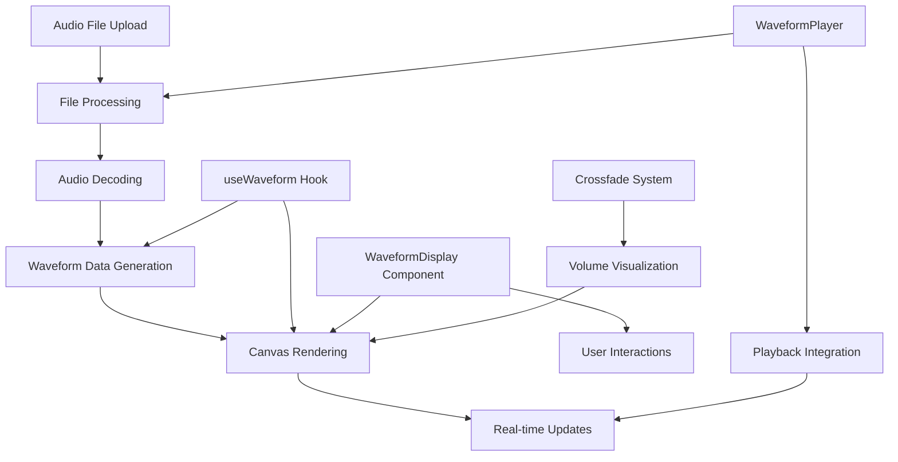

# Waveforms System Overview 🌊

The Waveforms system provides professional audio visualization by processing uploaded audio files into high-fidelity stereo waveform displays. It combines efficient audio decoding, smart data processing, canvas-based rendering, and real-time playback tracking to create an intuitive visual representation of audio content.

## Table of Contents

- [Architecture Overview](#architecture-overview)
- [Audio File Processing Pipeline](#audio-file-processing-pipeline)
- [Waveform Data Generation](#waveform-data-generation)
- [Canvas Rendering System](#canvas-rendering-system)
- [Stereo Channel Visualization](#stereo-channel-visualization)
- [Real-time Playback Tracking](#real-time-playback-tracking)
- [Crossfade Integration](#crossfade-integration)
- [Performance Optimization](#performance-optimization)
- [Interactive Features](#interactive-features)
- [Visual Design](#visual-design)
- [Error Handling](#error-handling)

## Architecture Overview

The Waveforms system consists of several interconnected components that work together to transform raw audio data into interactive visual representations:



### Key Components

- **useWaveform Hook**: Core processing and rendering logic
- **WaveformDisplay Component**: React component for display
- **Audio Decoding Pipeline**: File to AudioBuffer conversion
- **Canvas Rendering Engine**: High-performance visualization
- **Interactive System**: Click-to-seek functionality
- **Crossfade Integration**: Volume-aware visualization

## Audio File Processing Pipeline

### File Upload to Visualization Flow

The complete pipeline from uploaded file to rendered waveform:

```typescript
// 1. File Upload (Drag & Drop or File Selection)
const file: File = selectedAudioFile;

// 2. Blob URL Creation for Audio Element
const fileUrl = URL.createObjectURL(file);

// 3. Audio Buffer Extraction for Waveform
const arrayBuffer = await file.arrayBuffer();
const audioBuffer = await audioContext.decodeAudioData(arrayBuffer);

// 4. Waveform Data Generation
await waveform.generateStereoWaveformData(audioBuffer);

// 5. Canvas Rendering
waveform.drawWaveforms(leftCanvas, rightCanvas, config, currentTime, duration, crossfadeVolume);
```

### Audio Decoding Process

#### Temporary AudioContext for Decoding
```typescript
const initializeAudio = async () => {
  // Create temporary context for decoding only
  const tempContext = new (window.AudioContext || (window as any).webkitAudioContext)();
  
  // Decode audio data
  const arrayBuffer = await file.arrayBuffer();
  const audioBuffer = await tempContext.decodeAudioData(arrayBuffer);
  
  // Extract metadata and generate waveforms
  const extractedMetadata = await metadata.extractAudioMetadata(audioBuffer, file);
  await waveform.generateStereoWaveformData(audioBuffer);
  
  // Clean up temporary context
  await tempContext.close();
};
```

#### Supported Audio Formats
The system supports all Web Audio API compatible formats:
- **MP3**: Most common format
- **WAV**: Uncompressed audio
- **FLAC**: Lossless compression
- **AAC**: Apple/iTunes format
- **OGG**: Open source format
- **M4A**: Apple compressed format

## Waveform Data Generation

### Stereo Channel Processing

The system processes left and right channels separately for accurate stereo representation:

```typescript
const generateStereoWaveformData = async (audioBuffer: AudioBuffer) => {
  const width = 800; // Fixed resolution for consistent performance
  const samples = audioBuffer.length;
  const samplesPerPixel = Math.floor(samples / width);
  
  // Extract channel data
  const leftChannelData = audioBuffer.getChannelData(0);
  const rightChannelData = audioBuffer.numberOfChannels > 1 
    ? audioBuffer.getChannelData(1) 
    : leftChannelData; // Mono fallback
};
```

### Min/Max Peak Detection Algorithm

For each pixel column, the system calculates minimum and maximum sample values:

```typescript
// Process each pixel column
for (let x = 0; x < width; x++) {
  const startSample = x * samplesPerPixel;
  const endSample = Math.min(startSample + samplesPerPixel, samples);
  
  let min = 0;
  let max = 0;
  
  // Find peaks within sample range
  for (let i = startSample; i < endSample; i++) {
    const sample = leftChannelData[i];
    if (sample < min) min = sample;
    if (sample > max) max = sample;
  }
  
  // Store min/max pair for this pixel
  leftProcessedData[x * 2] = min;     // Minimum value
  leftProcessedData[x * 2 + 1] = max; // Maximum value
}
```

### Data Structure Optimization

#### Efficient Data Storage
```typescript
interface WaveformData {
  leftWaveformData: Float32Array;  // [min, max, min, max, ...]
  rightWaveformData: Float32Array; // [min, max, min, max, ...]
  width: number;                   // 800 pixels
  samplesPerPixel: number;         // Compression ratio
  duration: number;                // Audio duration in seconds
}
```

#### Memory Management
- **Fixed Resolution**: 800 pixels for consistent memory usage
- **Float32Array**: Efficient native arrays
- **Min/Max Pairs**: 2 values per pixel (minimum and maximum)
- **Separate Channels**: Independent left/right processing

## Canvas Rendering System

### Dual Canvas Architecture

The system uses separate canvases for left and right channels:

```typescript
// Left channel canvas (top)
<canvas
  ref={leftCanvasRef}
  width={800}
  height={60}
  className="w-full h-16 bg-audio-bg rounded-t-2xl border border-b-0 border-slate-700/50"
/>

// Right channel canvas (bottom)
<canvas
  ref={rightCanvasRef}
  width={800}
  height={60}
  className="w-full h-16 bg-audio-bg rounded-b-2xl border border-t-0 border-slate-700/50"
/>
```

### Canvas Rendering Pipeline

#### 1. Canvas Preparation
```typescript
const drawChannelWaveform = (canvas: HTMLCanvasElement, waveformData: Float32Array) => {
  const ctx = canvas.getContext('2d');
  const width = canvas.width;
  const height = canvas.height;
  const centerY = height / 2;
  
  // Clear previous content
  ctx.fillStyle = '#0f172a';
  ctx.fillRect(0, 0, width, height);
};
```

#### 2. Center Line Guide
```typescript
// Draw dashed center line for reference
ctx.strokeStyle = '#334155';
ctx.lineWidth = 1;
ctx.setLineDash([3, 3]);
ctx.beginPath();
ctx.moveTo(0, centerY);
ctx.lineTo(width, centerY);
ctx.stroke();
ctx.setLineDash([]);
```

#### 3. Gradient Generation
```typescript
// Dynamic gradient based on crossfade volume
const opacity = crossfadeVolume === 0 ? 0.1 : Math.max(0.3, crossfadeVolume || 1);
const fillGradient = ctx.createLinearGradient(0, 0, 0, height);
fillGradient.addColorStop(0, config.waveColor + Math.round(opacity * 64).toString(16).padStart(2, '0'));
fillGradient.addColorStop(0.5, config.waveColor + Math.round(opacity * 32).toString(16).padStart(2, '0'));
fillGradient.addColorStop(1, config.waveColor + Math.round(opacity * 64).toString(16).padStart(2, '0'));
```

#### 4. Waveform Path Drawing
```typescript
// Draw positive peaks outline
ctx.beginPath();
for (let x = 0; x < width; x++) {
  const max = waveformData[x * 2 + 1];
  const y = centerY - (max * centerY * 0.9); // 90% of available height
  if (x === 0) {
    ctx.moveTo(x, y);
  } else {
    ctx.lineTo(x, y);
  }
}
ctx.stroke();
```

#### 5. Fill Area Rendering
```typescript
// Create filled waveform shape
ctx.beginPath();
// Top peaks (positive)
for (let x = 0; x < width; x++) {
  const max = waveformData[x * 2 + 1];
  const y = centerY - (max * centerY * 0.9);
  ctx.lineTo(x, y);
}
// Bottom peaks (negative) - reverse direction
for (let x = width - 1; x >= 0; x--) {
  const min = waveformData[x * 2];
  const y = centerY - (min * centerY * 0.9);
  ctx.lineTo(x, y);
}
ctx.closePath();
ctx.fill();
```

## Stereo Channel Visualization

### Channel Separation Benefits

The stereo visualization provides several professional advantages:

#### 1. Phase Relationship Visualization
- **Mono Compatibility**: Identical left/right patterns indicate mono content
- **Stereo Width**: Different patterns show stereo separation
- **Phase Issues**: Inverted patterns reveal phase problems

#### 2. Channel Balance Analysis
- **Level Differences**: Visual comparison of left/right levels
- **Panning Detection**: Content distribution across stereo field
- **Mix Assessment**: Professional mixing evaluation

### Channel Labeling System

```typescript
// Clear channel identification
ctx.fillStyle = crossfadeVolume === 0 ? '#ffffff40' : '#ffffff80';
ctx.font = 'bold 12px Inter';
ctx.fillText(channelLabel, 8, 20); // 'L' or 'R'
```

### Responsive Channel Display

The system adapts to different audio content:

#### Mono File Handling
```typescript
// Automatic mono detection and mirroring
const rightChannelData = audioBuffer.numberOfChannels > 1 
  ? audioBuffer.getChannelData(1) 
  : leftChannelData; // Use left channel for both
```

#### Multi-channel Downmixing
For files with more than 2 channels, the system uses the first two channels for left/right representation.

## Real-time Playback Tracking

### Playback Position Visualization

The system provides real-time visual feedback of playback position:

```typescript
// Draw playback position line
if (duration > 0 && currentTime > 0) {
  const playbackX = (currentTime / duration) * width;
  
  ctx.strokeStyle = crossfadeVolume === 0 ? '#ffffff40' : '#ffffff';
  ctx.lineWidth = 2;
  
  // Add glow effect when not faded out
  if (crossfadeVolume > 0) {
    ctx.shadowColor = '#ffffff';
    ctx.shadowBlur = 6;
  }
  
  ctx.beginPath();
  ctx.moveTo(playbackX, 0);
  ctx.lineTo(playbackX, height);
  ctx.stroke();
  ctx.shadowBlur = 0;
}
```

### Update Optimization

#### Frame Rate Management
```typescript
// Redraw only when necessary
useEffect(() => {
  if (!isLoading && hasWaveformData()) {
    drawWaveforms(
      leftCanvasRef.current,
      rightCanvasRef.current,
      config,
      currentTime,
      duration,
      crossfadeVolume
    );
  }
}, [currentTime, duration, crossfadeVolume, config, isLoading]);
```

#### Smart Re-rendering
- **Dependency Tracking**: Only redraw when values change
- **Loading State**: Prevent rendering during file processing
- **Data Availability**: Check for valid waveform data

## Crossfade Integration

### Volume-Aware Visualization

The waveform display adapts to crossfade volume changes:

#### Visual Opacity Mapping
```typescript
// Crossfade volume affects visual prominence
const opacity = crossfadeVolume === 0 ? 0.1 : Math.max(0.3, crossfadeVolume || 1);

// Apply to both stroke and fill
ctx.strokeStyle = config.waveColor + Math.round(opacity * 255).toString(16).padStart(2, '0');
ctx.fillStyle = fillGradient; // Gradient already includes opacity
```

#### Playback Indicator Adaptation
```typescript
// Playback line visibility based on crossfade state
ctx.strokeStyle = crossfadeVolume === 0 ? '#ffffff40' : '#ffffff';

// Glow effect only when track is active
if (crossfadeVolume > 0) {
  ctx.shadowColor = '#ffffff';
  ctx.shadowBlur = 6;
}
```

### Container Visual Feedback

```typescript
// Track container opacity reflects crossfade state
<div className={`glass-panel rounded-3xl p-6 border border-slate-600 transition-all duration-300 ${
  crossfadeVolume === 0 ? 'opacity-60' : ''
}`}>
```

## Performance Optimization

### Efficient Data Processing

#### Fixed Resolution Strategy
```typescript
// Always process to 800 pixels regardless of file length
const width = 800;
const samplesPerPixel = Math.floor(samples / width);
```

**Benefits:**
- **Consistent Memory Usage**: Predictable RAM requirements
- **Stable Performance**: Same processing time regardless of file size
- **Scalable Rendering**: Canvas resolution independent of audio length

#### Memory Management

##### Smart Buffer Allocation
```typescript
// Reuse Float32Array instances
const leftProcessedData = new Float32Array(width * 2);
const rightProcessedData = new Float32Array(width * 2);

// Store in refs to prevent recreation
leftWaveformData.current = leftProcessedData;
rightWaveformData.current = rightProcessedData;
```

##### Cleanup Strategy
```typescript
const clearWaveformData = useCallback(() => {
  leftWaveformData.current = null;
  rightWaveformData.current = null;
}, []);

// Automatic cleanup on component unmount
useEffect(() => {
  return () => {
    audioContext.cleanup();
  };
}, []);
```

### Canvas Optimization Techniques

#### Context Reuse
```typescript
// Single context retrieval per render
const ctx = canvas.getContext('2d');
if (!ctx) return;
```

#### Batch Drawing Operations
```typescript
// Group similar drawing operations
ctx.beginPath();
// ... multiple path operations ...
ctx.stroke(); // Single stroke call
```

#### Efficient Gradient Creation
```typescript
// Create gradient once per render
const fillGradient = ctx.createLinearGradient(0, 0, 0, height);
// Apply to all fill operations
```

## Interactive Features

### Click-to-Seek Functionality

The waveform provides intuitive navigation through click interaction:

```typescript
const handleWaveformClick = (e: React.MouseEvent<HTMLCanvasElement>) => {
  if (!duration || !canPlay) return;

  const canvas = e.currentTarget;
  const rect = canvas.getBoundingClientRect();
  const x = e.clientX - rect.left;
  
  // Calculate time position
  const clickTime = (x / rect.width) * duration;
  
  onWaveformClick(clickTime);
};
```

### Responsive Interaction States

#### Hover Effects
```css
.cursor-pointer hover:border-slate-600 transition-colors
```

#### Visual Feedback
- **Border Color Changes**: Subtle hover indication
- **Cursor Changes**: Pointer cursor for clickable areas
- **Disabled States**: Visual indication when seeking unavailable

### Accessibility Considerations

#### Keyboard Navigation
While primarily visual, the waveform integrates with keyboard controls:
- **Space Bar**: Play/pause at current position
- **Arrow Keys**: Fine seeking (handled by parent component)
- **Click Seeking**: Alternative to keyboard navigation

## Visual Design

### Professional Audio Aesthetics

The waveform design follows professional audio software conventions:

#### Color Scheme
```typescript
interface WaveformConfig {
  waveColor: string;    // Primary waveform color (#10b981 or #8b5cf6)
  bgColor: string;      // Background color
  hoverColor: string;   // Hover state color
  textColor: string;    // Text color for labels
}
```

#### Track Color Coding
- **Track A**: Emerald green (`#10b981`) - Professional standard
- **Track B**: Purple (`#8b5cf6`) - Clear visual distinction
- **Crossfade**: Dynamic opacity based on volume levels

### Visual Hierarchy

#### Layout Structure
```typescript
// Stacked stereo display
┌─────────────────────────────────┐
│ L │ Left Channel Waveform       │ <- Top canvas
├─────────────────────────────────┤
│ R │ Right Channel Waveform      │ <- Bottom canvas
└─────────────────────────────────┘
```

#### Information Display
- **Channel Labels**: Clear L/R identification
- **Playback Position**: Vertical line with glow effect
- **Center Reference**: Dashed horizontal guide line
- **Loading States**: Spinner and descriptive text

### Responsive Design Elements

#### Loading State
```typescript
if (isLoading) {
  return (
    <div className="w-full h-32 bg-audio-bg rounded-2xl border border-slate-700/50 flex items-center justify-center">
      <div className="flex items-center gap-2 text-audio-text-dim">
        <div className="w-4 h-4 border-2 border-current border-t-transparent rounded-full animate-spin"></div>
        <span className="text-sm">Loading stereo waveforms...</span>
      </div>
    </div>
  );
}
```

#### Adaptive Sizing
- **Fixed Canvas Resolution**: 800x60 pixels per channel
- **CSS Scaling**: Responsive width with aspect ratio maintenance
- **Container Flexibility**: Adapts to parent component sizing

## Error Handling

### Robust Error Management

#### File Processing Errors
```typescript
try {
  const arrayBuffer = await file.arrayBuffer();
  const audioBuffer = await tempContext.decodeAudioData(arrayBuffer);
  await waveform.generateStereoWaveformData(audioBuffer);
} catch (error) {
  console.error('WaveformPlayer: Failed to initialize audio:', error);
  setError(`Failed to load audio file: ${error instanceof Error ? error.message : 'Unknown error'}`);
  setIsLoading(false);
}
```

#### Canvas Rendering Safeguards
```typescript
const drawChannelWaveform = (canvas: HTMLCanvasElement, waveformData: Float32Array) => {
  if (!canvas || !waveformData) return;
  
  const ctx = canvas.getContext('2d');
  if (!ctx) return;
  
  // Safe rendering operations...
};
```

### Recovery Mechanisms

#### Automatic Retry
```typescript
{error && (
  <button
    onClick={() => {
      setError(null);
      setIsLoading(true);
      currentFile.current = null; // Force re-initialization
    }}
    className="px-4 py-2 bg-red-500 hover:bg-red-600 text-white rounded-xl text-sm transition-colors"
  >
    Retry
  </button>
)}
```

#### Graceful Degradation
- **Missing Data**: Show loading state instead of broken visuals
- **Canvas Errors**: Fallback to text-based information
- **File Format Issues**: Clear error messages with suggested solutions

### Validation Checks

#### Data Integrity
```typescript
const hasWaveformData = useCallback(() => {
  const hasData = leftWaveformData.current !== null && rightWaveformData.current !== null;
  return hasData;
}, []);

// Usage in rendering logic
if (!isLoading && hasWaveformData()) {
  drawWaveforms(...);
}
```

---

## Integration Points

### Main Application Integration
The Waveforms system integrates seamlessly with:
- **File Upload System**: Automatic processing of dropped/selected files
- **Playback Engine**: Real-time position tracking and seek operations
- **Crossfade System**: Volume-aware visual feedback
- **Settings System**: Customizable colors and preferences

### Future Enhancements
- **Zoom Functionality**: Variable resolution for detailed editing
- **Multi-track Display**: Support for files with more than 2 channels
- **Spectrogram Integration**: Combined time/frequency visualization
- **Selection Tools**: Region selection for loop points or analysis
- **Export Capabilities**: Save waveform images for documentation

The Waveforms system provides a professional foundation for audio visualization that balances performance, accuracy, and user experience while maintaining compatibility with modern web standards and accessibility requirements. 